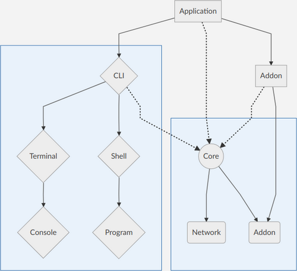

PhpCliShell
-------------------

PhpCliShell is a project to help network administrators with many applications.<br />
All applications run in CLI mode and permit to stay in terminal.<br />

There is 4 applications available in PhpCliShell:
* NetBox permit to browse IPAM objects and do some research
* phpIPAM permit to browse IPAM objects and do some research
* PatchManager permit to browse DCIM objects and do some research
* FIREWALL is an ACL/NAT rules manager with firewall appliance templating.<br />  
  > FIREWALL service can use IPAM application to retrieve objects

Addon informations:
* NetBox is an IPAM in PHP with REST API: https://netbox.readthedocs.io
* phpIPAM is an IPAM in PHP with REST API: https://phpipam.net
* PatchManager is an DCIM in JAVA with SOAP and REST API: https://patchmanager.com

It is possible to develop another addon and application with custom commands base on PhpCliShell.<br />
PhpCliShell has a wizard tool which permit to create configuration and launcher very easily.<br />



INSTALLATION
-------------------

#### PHP
Ubuntu only, you can get last PHP version from this PPA:<br />
__*https://launchpad.net/~ondrej/+archive/ubuntu/php*__
* add-apt-repository ppa:ondrej/php
* apt update

You have to install a PHP version >= 7.1:
* apt install php7.3-cli php7.3-mbstring php7.3-readline pphp7.3-soap php7.3-curl

For MacOS users which use PHP 7.3, there is an issue with PCRE.
You have to add this configuration in your php.ini:
```ini
pcre.jit=0
```
> To locate your php.ini, use this command: php -i | grep "Configuration File" *

#### PHAR
Download last PHAR release and its public key from [releases](https://github.com/Renji-FR/PhpCliShell/releases)<br />
> Be careful to keep public key filename same as PHAR filename with ".phar" extension

Print console help: `$ php phpCliShell.phar --help`
> The PHAR contains all PhpCliShell applications and addons

#### ADDON / APPLICATION
__Please read application README before use it__
- NetBox: [README](src/phpCliShell/application/netbox/README.md)
- phpIPAM: [README](src/phpCliShell/application/phpipam/README.md)
- PatchManager: [README](src/phpCliShell/application/patchmanager/README.md)
- FIREWALL: [README](src/phpCliShell/application/firewall/README.md)