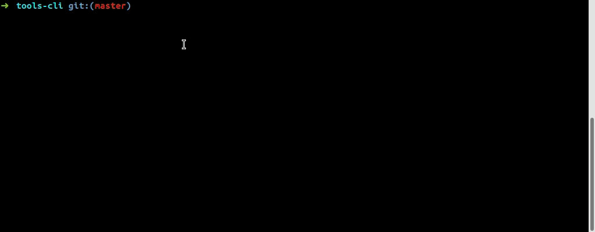
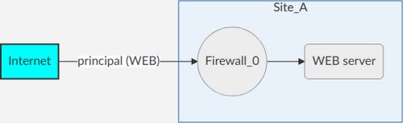
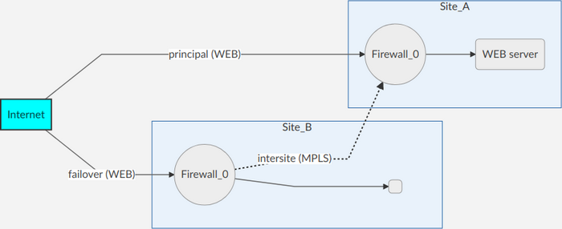
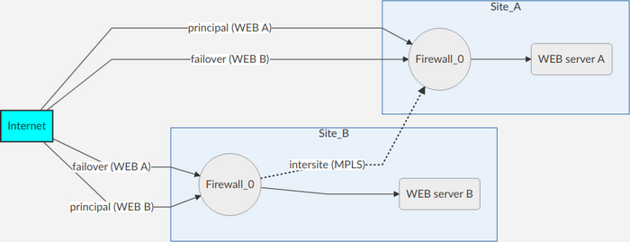

PhpCliShell for FIREWALL
-------------------

This application FIREWALL permit to create rules (ACL) and translations (NAT).<br />
With this application administrators can manage firewall objects in CLI and generate config for their appliance.




#### ACL types
__ACL monosite:__
* basic ACL, source(s), destination(s), no automation. For this ACL category you can not enable fullmesh option!


__ACL failover:__
* __without fullmesh option:__ failover ACL(s) will be automaticaly generated for all failover sites in inbound or outbound.


* __with fullmesh option:__ like without but source and destination of ACL will be isolated per zone to process automation.


#### NAT types
__NAT one-way:__ Static NAT with dynamic NAT for internet access for example<br />
https://www.cisco.com/c/en/us/td/docs/security/asa/asa90/configuration/guide/asa_90_cli_config/nat_overview.html#73370

__NAT two-way:__ Static NAT with static PAT for mail service for example<br />
https://www.cisco.com/c/en/us/td/docs/security/asa/asa90/configuration/guide/asa_90_cli_config/nat_overview.html#11517

#### Templates
For the moment, there are 3 templates:
* Juniper JunOS<br />
  > there are 2 templates for Juniper JunOS: one formated with {} and one with set commands
* Cisco ASA<br />
  > there are 2 templates for Cisco ASA: one for the firewall itself and one for VPN DAP (Dynamic Access Policies)
* Web HTML

#### IPAM
There is 2 IPAM connectors:
* phpIPAM [https://phpipam.net]
* NetBox [https://netbox.readthedocs.io]
> To configure IPAM addon use `php phpCliShell.phar configuration:addon:factory` command

#### Features
| Feature | Description | Information |
|---------|-------------|-------------|
| ACL rules | Manage ACL rules from one tool | Attributes: state, action, source(s), destination(s), protocol(s), description, tag |
| NAT rules | Manage NAT rules from one tool | :heavy_exclamation_mark: BETA |
| Admin features | There is many commands to help administrator | object research, flow research, clone rule, replace object by another, ... |
| IP dualstack | Of course FIREWALL application is full dualstack IPv4 and IPv6 | :heavy_check_mark: |
| IPAM | Find objects from IPAM (subnet, address)<br />Commands: search, import, refresh | Connectors: phpIPAM, NetBox |
| Zones / Interfaces | Configuration topology to determine the zone/interface where rule must be installed | Configuration example [here](configurations/demo.json) |
| Templates | Compatible multi-vendor, you can manage your rules from one tool for many firewall vendors<br />You can migrate rules from one firewall model to another | Cisco ASA (+DAP), Juniper JunOS (+SET), HTML (AG-GRID) |
| Export config | Export rules (and address objects) in firewall format to manual publish | |
| Copy config export | Copy export directly to firewall with SCP in firewall flash | Compatible with SSH tunnel/bastion<br />For Cisco ASA multi-context use share storage |
| Backup | Address objects (host, subnet, network) are saved in separate JSON file<br />Rules (ACL & NAT) are saved in one JSON file<br />For humans, CSV files are created too | Thought for GIT (git diff, ...) |
| Import backup file | You can import another backup file with prefix for rules<br />This feature allow to separate rules like VPN and services rules | |
| Import firewall config | You can import firewall configuration from its config files (manual) or appliance (auto, require SSH) in tool | |

#### Juniper JunOS
When you export configuration and copy it to firewall, you have to use this process:
* load set [configPathname]
* show | compare
* commit check
* commit confirm 2
* commit

When you copy directly from tool, you can configure remote target in firewall configuration tool: `NETWORK_FIREWALL > sites > [site] > scp_remoteFile`
```json
"scp_remoteFile": /var/tmp/new-rules.txt
```

#### Cisco ASA
When you export configuration and copy it to firewall, you have to use this process:
* copy [configPathname] running-config
* copy running-config startup-config

For multi-context configuration, you have to upgrade your firewall to version 9.6(2) min:
* storage-url {private | shared} [diskn:/]path [context_label]
* https://www.cisco.com/c/en/us/td/docs/security/asa/asa-command-reference/S/cmdref3/s16.html#pgfId-1761191
* https://www.cisco.com/c/en/us/td/docs/security/asa/asa96/configuration/general/asa-96-general-config/ha-contexts.html

When you copy directly from tool, you can configure remote target in firewall configuration tool: `NETWORK_FIREWALL > sites > [site] > scp_remoteFile`
```json
"scp_remoteFile": shared-storage/new-rules.txt
```


INSTALLATION
-------------------

#### PHP
Ubuntu only, you can get last PHP version from this PPA:<br />
__*https://launchpad.net/~ondrej/+archive/ubuntu/php*__
* add-apt-repository ppa:ondrej/php
* apt update

You have to install a PHP version >= 7.1:
* apt install php7.3-cli php7.3-mbstring php7.3-readline pphp7.3-soap php7.3-curl

For MacOS users which use PHP 7.3, there is an issue with PCRE.
You have to add this configuration in your php.ini:
```ini
pcre.jit=0
```
> To locate your php.ini, use this command: php -i | grep "Configuration File" *

#### PHAR
Download last PHAR release and its public key from [releases](https://github.com/Renji-FR/PhpCliShell/releases)<br />
> Be careful to keep public key filename same as PHAR filename with ".phar" extension

Print console help: `$ php phpCliShell.phar --help`
> The PHAR contains all PhpCliShell applications and addons

#### DEMO


Start FIREWALL demo with command:<br />
`$ php phpCliShell.phar firewall:application:demo`

#### WIZARD


Create FIREWALL application configuration with command:<br />
`$ php phpCliShell.phar configuration:application:factory firewall`<br />
*For more informations about configuration file, see 'CONFIGURATION' section*

Create FIREWALL application launcher with command:<br />
`$ php phpCliShell.phar launcher:application:factory firewall`

Create FIREWALL IPAM addon configuration with this command:<br />
`$ php phpCliShell.phar configuration:addon:factory ipam`


EXECUTION
-------------------

#### CREDENTIALS FILE
Credentials are used for copy configuration to appliance with SCP and IPAM connector.<br />
If you don't use these features, go to next section.<br />
__*Change informations which are between []*__
* vim credentialsFile
    * read -sr USER_PASSWORD_INPUT
        * export SSH_SYS_LOGIN=[YourSystemLoginHere]
        * export SSH_NET_LOGIN=[YourNetworkLoginHere]
        * export SSH_NET_PASSWORD=$USER_PASSWORD_INPUT<br />
          > Bastion authentication must be base on certificate

        __IPAM__ (Only if you use IPAM service/addon)<br />
        /!\ For security reason, use a read only account!
        * export IPAM_[IPAM_SERVER_KEY]_LOGIN=[YourLoginHere]
	    * export IPAM_[IPAM_SERVER_KEY]_PASSWORD=$USER_PASSWORD_INPUT<br />
          > Change [IPAM_SERVER_KEY] with the key of your IPAM server in configuration file

#### SHELL
Launch PhpCliShell for FIREWALL service
* source credentialsFile
* php firewall.[env].php


CONFIGURATION
-------------------
* Juniper JunOS
    * In your configuration file, you can change the push method:<br />
	```json
	"templates": {
		"juniper-junos_set": {
			"updateMode": "replace"
		}
	}
	```
    > Available modes: merge or replace
* Cisco ASA
    * Add this configuration in options section under sites to declare a global zone:<br />
	```json
	"options": {
		"globalZone": "global"
	}
	```


FAQ
-------------------

:black_small_square: How to enable SCP/SSH feature to permit copy config export directly to remote appliance :question:
* Edit your firewall configuration, you can use user/custom configuration
* SCP configuration, these informations are used to connect to firewall
```
# Enable SCP feature
"scp": true,

# SCP login, change it with your account login (not secure, favor environment variable)
"scp_loginCredential": false,

# Use environment variable for your SCP account login, change it with variable name (recommended)
"scp_loginEnvVarName": false,

# SCP password, change it with your account password (not secure, favor environment variable)
"scp_passwordCredential": false,

# Use environment variable for your SCP account password, change it with variable name (recommended)
"scp_passwordEnvVarName": false,

# Remote pathname where configuration export file will be copied
"scp_remoteFile": false,

# Remote SSH port, by default SSH use port 22, must have a value
"ssh_remotePort": false,
```
* SSH configuration, these informations are used to etablish a tunnel SSH or to use bastion SSH
```
# Tunnel or bastion address, can be a SSH config entry (~/.ssh/config)
"ssh_bastionHost": false,

# Tunnel or bastion port, by default SSH use port 22, must have a value
"ssh_bastionPort": false,

# This port is used as tunnel destination port, port must be free in local
"ssh_portForwarding": false,

# SSH login, change it with your account login (not secure, favor environment variable)
"ssh_loginCredential": false,

# Use environment variable for your SSH account login, change it with variable name (recommended)
"ssh_loginEnvVarName": false,

# SSH password, change it with your account password (not secure, favor environment variable)
"ssh_passwordCredential": false,

# Use environment variable for your SSH account password, change it with variable name (recommended)
"ssh_passwordEnvVarName": false,
```
  > If you want use certificate authentication for tunnel or bastion remote, leave ssh_password\* attributes to false


:black_small_square: How to use user/custom configuration file to override team/common configuration :question:
* Create your user/custom configuration in configurations root directory with ".user.json" suffix
* Add your own configuration like pathname or filename but do not override firewall topology
* Edit firewall launcher and add at the end of array your new configuration file<br />
  > If file does not exist in local, no error or exception is throw