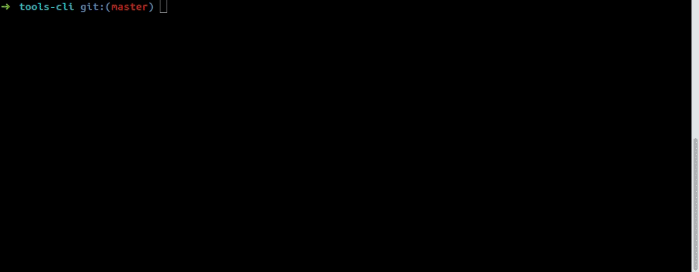

PhpCliShell for phpIPAM
-------------------

This application phpIPAM use phpIPAM addon and permit to browse IPAM objects.<br />
It is possible to show section, folder, subnet and address. You can do some research.


REQUIREMENTS
-------------------

#### phpIPAM
For best performance, you can install custom API controllers but it is possible to use a default connector.

:interrobang: Tested on PHPIPAM version 1.3.1: https://github.com/phpipam/phpipam
* Copy all custom API controllers located in addons/ipam/ressources on your PHPIPAM instance
    * Cw_sections.php: /var/www/phpipam/api/controllers/custom/Cw_sections.php
	* Cw_subnets.php: /var/www/phpipam/api/controllers/custom/Cw_subnets.php
	* Cw_vlans.php: /var/www/phpipam/api/controllers/custom/Cw_vlans.php
	* Cw_addresses.php: /var/www/phpipam/api/controllers/custom/Cw_addresses.php  

:bangbang: __*Do not rename custom controllers*__  
:bangbang: __*Version 2.0 add new profiles!*__


INSTALLATION
-------------------

#### PHP
Ubuntu only, you can get last PHP version from this PPA:<br />
__*https://launchpad.net/~ondrej/+archive/ubuntu/php*__
* add-apt-repository ppa:ondrej/php
* apt update

You have to install a PHP version >= 7.1:
* apt install php7.3-cli php7.3-mbstring php7.3-readline pphp7.3-soap php7.3-curl

For MacOS users which use PHP 7.3, there is an issue with PCRE.
You have to add this configuration in your php.ini:
```ini
pcre.jit=0
```
> To locate your php.ini, use this command: php -i | grep "Configuration File" *

#### PHAR
Download last PHAR release and its public key from [releases](https://github.com/Renji-FR/PhpCliShell/releases)<br />
> Be careful to keep public key filename same as PHAR filename with ".phar" extension

Print console help: `$ php phpCliShell.phar --help`
> The PHAR contains all PhpCliShell applications and addons

#### WIZARD



Create phpIPAM application configuration with command:<br />
`$ php phpCliShell.phar configuration:addon:factory ipam`<br />

Create phpIPAM application launcher with command:<br />
`$ php phpCliShell.phar launcher:application:factory ipam`


EXECUTION
-------------------

#### CREDENTIALS FILE
/!\ For security reason, you can use a read only account or API app configured in read only mode!  
__*Change informations which are between []*__
* vim credentialsFile
    * read -sr USER_PASSWORD_INPUT
    * export IPAM_[IPAM_SERVER_KEY]_LOGIN=[YourLoginHere]
    * export IPAM_[IPAM_SERVER_KEY]_PASSWORD=$USER_PASSWORD_INPUT  
      __Change [IPAM_SERVER_KEY] with the key of your phpIPAM server in configuration file__

#### SHELL
Launch PhpCliShell for phpIPAM service
* source credentialsFile
* php phpipam.[key].php

#### COMMAND
Get command result in order to handle with your OS shell.  
/!\ The result is JSON so you can use JQ https://stedolan.github.io/jq/  
__*Change informations which are between []*__
* source credentialsFile
* php phpipam.[key].php "[myCommandHere]"